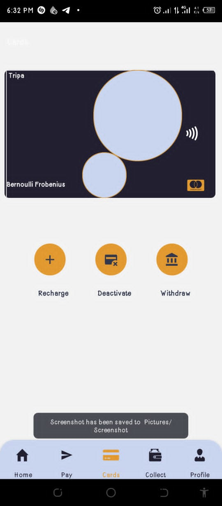
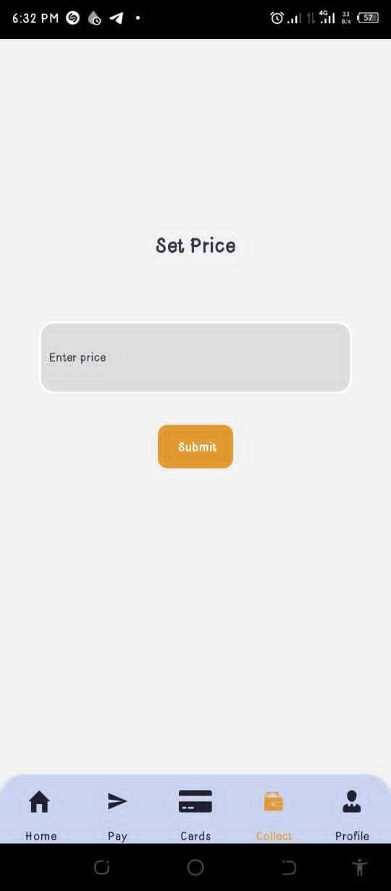
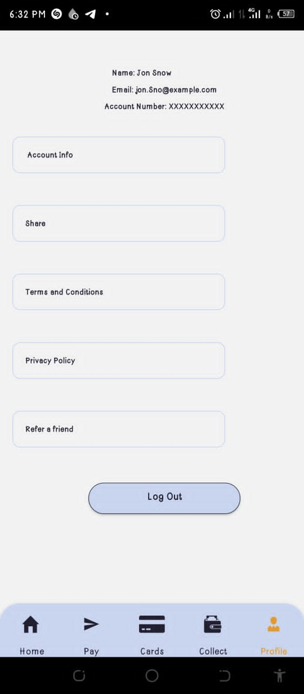
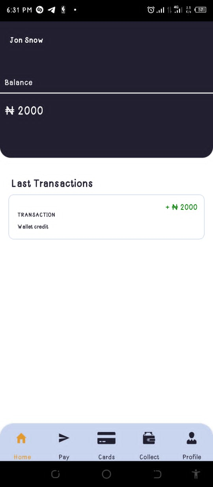
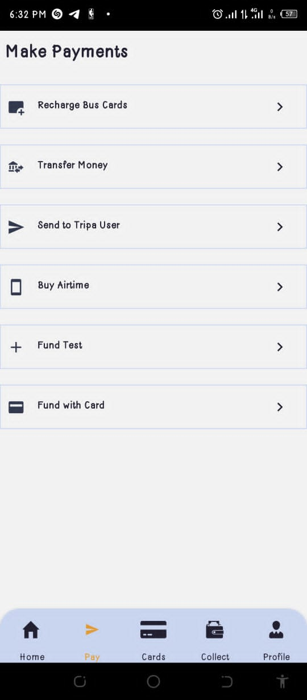

# Bus Card User Application

Welcome to the Bus Card User Application, a user-friendly mobile app designed to simplify your bus card management experience. This application works seamlessly with the Tripa backend to provide a comprehensive solution for handling bus card payments and transactions.

## Features

- **User Registration and Login**: Securely register and log in to your account with authentication and authorization.

- **Card Management**: Effortlessly manage your bus cards, including activation, deactivation, and deletion.

- **Funds Management**: Keep track of your balances and transaction history in real-time.

- **Payment Processing**: Seamlessly process payments using Flutterwave's payment gateway for secure transactions.

- **Payout Subaccounts**: Easily manage and transfer money between users and static account generations.

## Getting Started

To use the Bus Card User Application, follow these steps:

1. **Download the App**: Visit [App Store Link] or [Google Play Link] to download and install the app on your mobile device.

2. **Register or Log In**: Create a new account or log in with your existing credentials.

3. **Manage Your Bus Cards**: Add, activate, or deactivate your bus cards as needed.

4. **Check Balances and Transactions**: View your account balances and transaction history in real-time.

5. **Make Secure Payments**: Use the app to make secure bus card payments hassle-free.

## Technologies Used

- **React - Native**: The Bus Card User Application is built using the React Native framework for a smooth and consistent user experience across both iOS and Android platforms.

- **Flutterwave**: Integration with Flutterwave's payment gateway API ensures secure and reliable payment processing.
  # Bus Card User Application

## Screenshots

...

## Not Currently Up to date

Please note that this codebase is not currently being actively updated.  there may be limited ongoing development and maintenance. W

If you have any questions or feedback, please feel free to contact us at [oluwarotimiadewumi@gmail.com].

